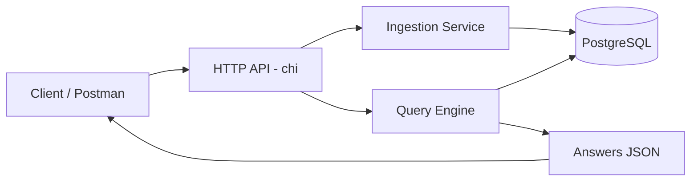
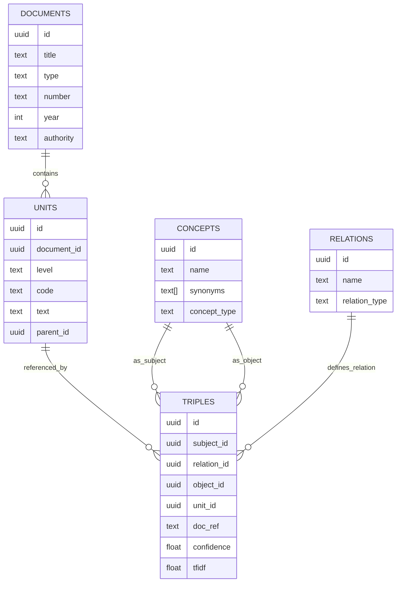
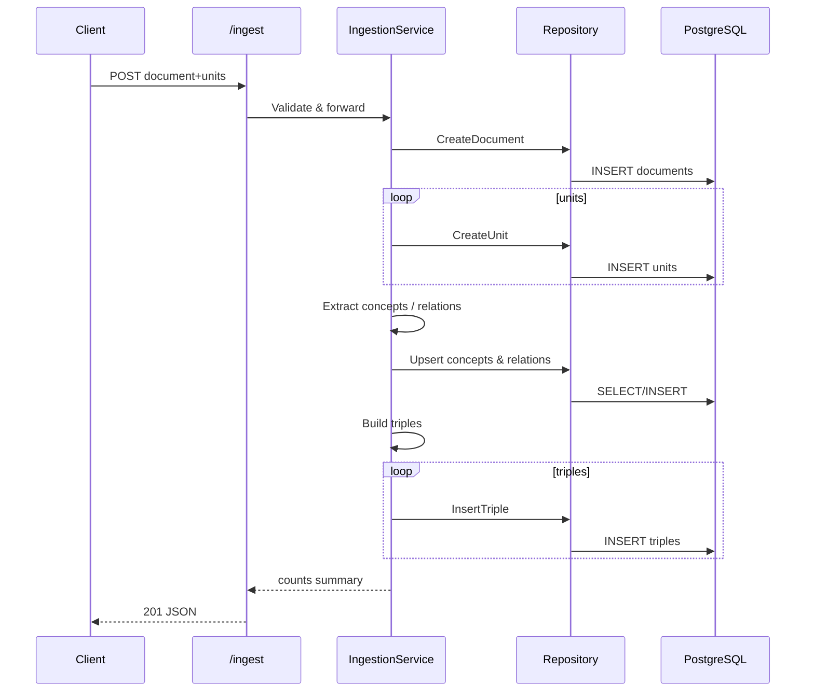
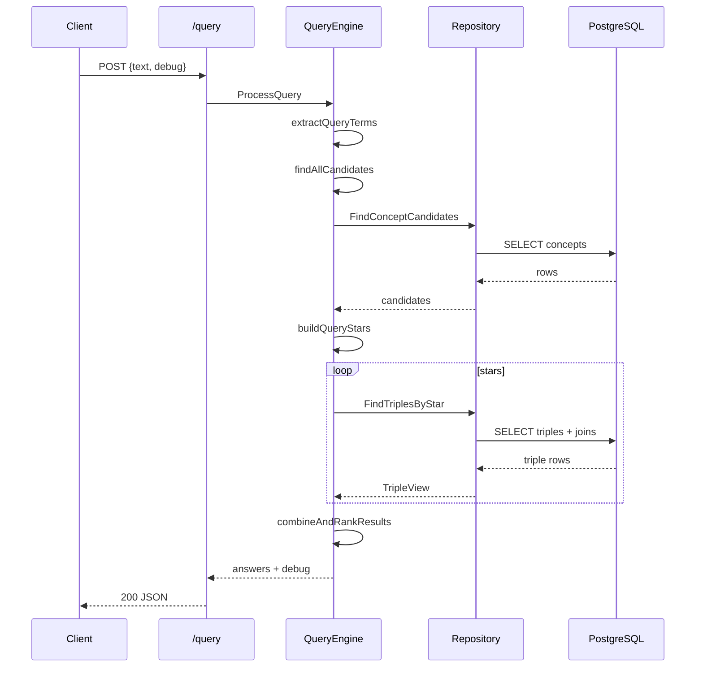

# Báo cáo Lý Thuyết & Hiện Thực Hệ Thống Legal-Supporter

## 1. Mục tiêu dự án
Xây dựng backend trợ lý pháp luật dựa trên **Knowledge Graph** cho phép:
- Nhập (ingest) tài liệu pháp luật có cấu trúc.
- Trích xuất tri thức dạng bộ ba (Subject–Relation–Object).
- Truy vấn ngữ nghĩa (semantic query) dựa trên khái niệm và quan hệ, không chỉ khớp từ khóa.
- Hỗ trợ synonyms song ngữ (Việt/Anh) để tăng recall.
- Cung cấp debug chi tiết pipeline xử lý truy vấn.

## 2. Kiến trúc tổng quan
```
Client (Postman/UI)
        |
        v
+-----------------+        +------------------+        +--------------------+
|  HTTP API (chi) | <----> |  Query / Ingest  | <----> |  PostgreSQL (Graph) |
+-----------------+        +------------------+        +--------------------+
          |                          |                          |
          v                          v                          v
   Query Engine               Ingestion Engine              Schema Tables
```

Mermaid:


## 3. Mô hình dữ liệu (Knowledge Graph)
Các thực thể chính:
- **documents**: Thông tin văn bản (tiêu đề, loại, năm, số hiệu,...)
- **units**: Các đơn vị cấu trúc (article, clause, point) + quan hệ cha–con.
- **concepts**: Khái niệm pháp lý (entity/action/condition/penalty) + synonyms.
- **relations**: Loại quan hệ (requires, prohibits, penalizes, defines,...)
- **triples**: Bộ ba S–R–O tham chiếu tới unit gốc + doc_ref.

ER (Mermaid):


## 4. Pipeline Ingestion
Input: JSON (document + units). Output: Lưu tri thức + thống kê.



### Các bước chi tiết
1. Parse & validate JSON (document bắt buộc, tối thiểu 1 unit).
2. Tạo document → nhận `id`.
3. Duyệt units, ánh xạ parent bằng `parent_code` (nếu có).
4. Heuristic / input synonyms tạo concepts mới hoặc mở rộng.
5. Sinh quan hệ mặc định (nếu phát hiện pattern văn bản – hiện ở mức tối giản).
6. Tạo triples (S-R-O) gắn với unit + doc_ref (ví dụ: "Decree 100/2019, Art 6").
7. Trả về thống kê: số units, concepts, relations, triples.

## 5. Pipeline Query
Input: Natural language text. Output: Ranked answers.

```mermaid
flowchart TD
  A[Query Text] --> B[Normalize & Term Extract]
  B --> C[Candidate Search (concepts/relations)]
  C --> D[Build Stars (S? R? O?)]
  D --> E[Triple Matching]
  E --> F[Combine & Ranking]
  F --> G{debug?}
  G -- yes --> H[Attach timings, stars, candidates]
  G -- no --> I[Answers only]
  H --> J[JSON]
  I --> J[JSON]
```

Sequence chi tiết:


### Thuật toán chính
- Term extraction: lowercase + tách từ + bỏ stop words EN cơ bản.
- Candidate search: so khớp name + synonyms (score ưu tiên match trực tiếp).
- Star building: tổ hợp candidate vào dạng (Subject?, Relation?, Object?).
- Triple search: lọc theo các tập ID ứng viên.
- Ranking: kết hợp candidate score + confidence + (tfidf nếu có).
- Debug: lưu `timings`, `candidates`, `stars`, `matching_triples`.

## 6. Lý do chọn Knowledge Graph
| Vấn đề | Giải pháp bằng Graph |
|--------|----------------------|
| Câu hỏi đa khái niệm | Triples cho phép nối quan hệ rõ ràng |
| Đồng nghĩa / song ngữ | Synonyms mảng trong concepts |
| Truy vấn mở rộng | Có thể mở thành embedding / reasoning |
| Giải thích kết quả | Trả về triple + doc_ref + snippet |

## 7. Thành phần mã nguồn chính
| File | Vai trò |
|------|---------|
| `cmd/api/main.go` | Khởi động server, router, middleware CORS |
| `internal/config/config.go` | Load biến môi trường (HTTP_PORT, DATABASE_URL) |
| `internal/db/db.go` | Kết nối pgxpool tới PostgreSQL |
| `internal/graph/models.go` | Định nghĩa struct Document/Unit/Concept/... |
| `internal/graph/repository.go` | Toàn bộ truy vấn DB CRUD + search + triple query |
| `internal/graph/ingestion.go` | Logic ingest + tạo concepts/relations/triples |
| `internal/graph/query_engine.go` | Thuật toán xử lý query & ranking |
| `internal/query/http.go` | Định nghĩa HTTP handlers (query, ingest, get unit) |

## 8. Kết quả hiện tại
- Ingest mẫu: 2 documents, 4 units, 6 concepts, 5 relations, 5 triples.
- Query ví dụ "helmet motorcycle": trả về đúng đoạn luật liên quan.
- Synonym mapping hoạt động với tiếng Việt ↔ tiếng Anh cơ bản.
- Thời gian xử lý query: mili-giây (nhỏ trên dataset demo).
- Debug mode giúp minh bạch toàn bộ pipeline.

## 9. Hạn chế & Hướng mở rộng
| Hạn chế | Hướng mở rộng |
|---------|---------------|
| Chưa có embedding semantic | Thêm vector store + cosine similarity |
| Extraction relations còn đơn giản | Áp dụng NLP model (spaCy / transformer) |
| Không có UI trực quan graph | Xây dựng frontend + graph visualization |
| Ranking sơ khai | Áp dụng BM25 / weighted scoring / learning to rank |
| Chưa có auth | Thêm JWT / RBAC |
| Logging & metrics cơ bản | Thêm Prometheus + Grafana |

## 10. Đề xuất bước tiếp
1. Chuẩn hóa pipeline ingestion → tách rõ stages (parse / enrich / persist).
2. Thêm endpoint quản lý concepts & relations.
3. Triển khai embedding (sentence-transformers) để tăng recall.
4. Viết test cho repository & query engine (unit + integration).
5. Benchmark dataset lớn hơn (≥ 1k units).

## 11. Demo Script gợi ý
1. Gọi ingest sample_data.json.
2. SELECT * FROM concepts / triples (show structure).
3. Gọi query với debug=true → phân tích candidates & stars.
4. Giải thích snippet + doc_ref.
5. Nêu hướng mở rộng (embedding & UI graph).

## 12. Kết luận
Hệ thống đã hiện thực đầy đủ chu trình: **Nhập tri thức pháp luật có cấu trúc → Lưu trữ dưới dạng đồ thị → Truy vấn ngữ nghĩa có giải thích**. Đây là nền tảng vững chắc để phát triển thành trợ lý pháp lý thông minh (Legal AI Assistant) mở rộng hơn.

---
(End of document)
