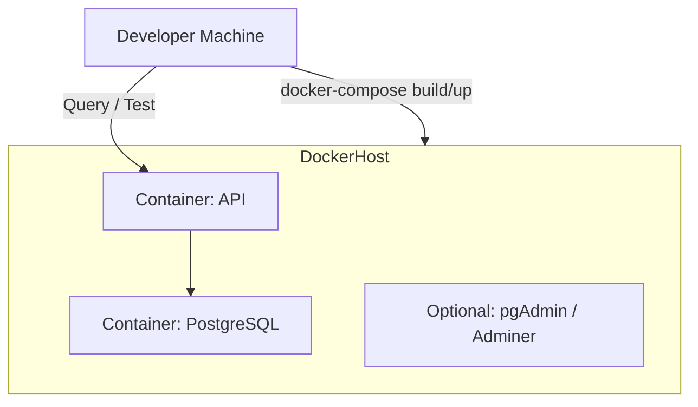
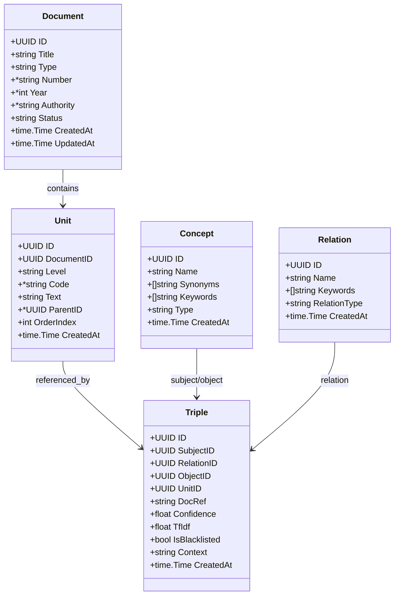
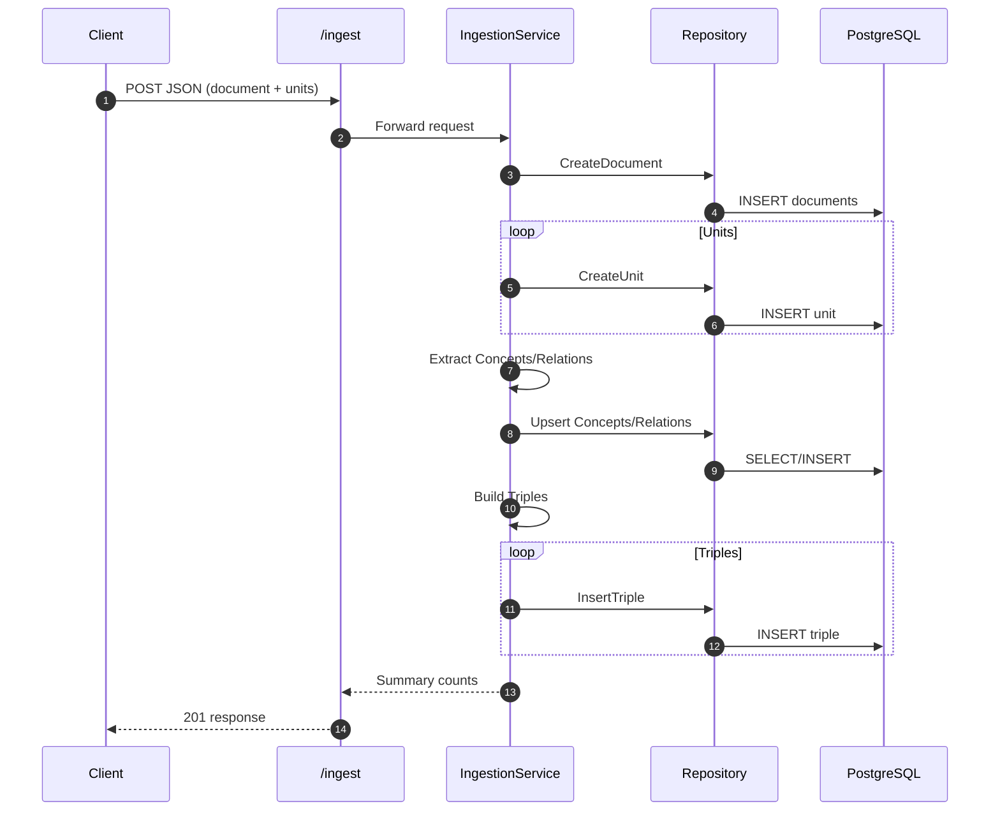
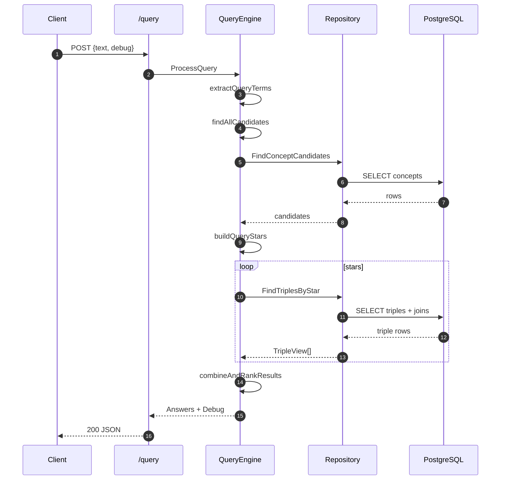
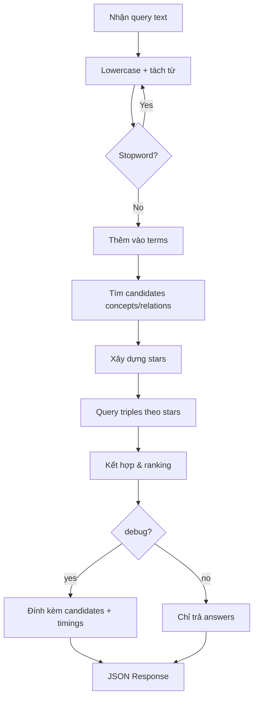
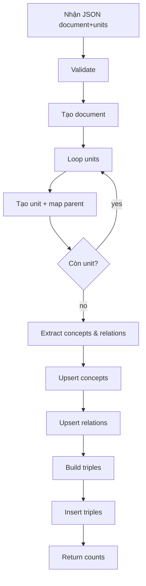
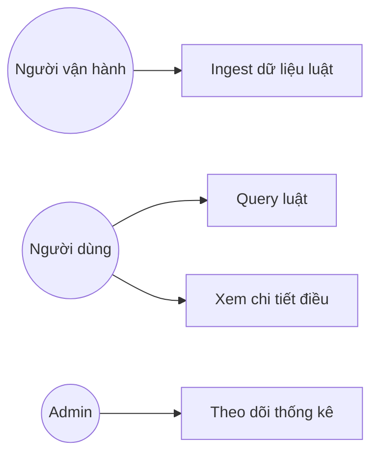

# UML & Sơ Đồ Kỹ Thuật (Mermaid)

> Các sơ đồ ở dạng Mermaid để dễ bảo trì. Có thể copy vào công cụ render (Mermaid Live, VSCode extension) hoặc đưa trực tiếp vào tài liệu Markdown.

## 1. Component Diagram (Tổng quan hệ thống)
```mermaid
flowchart LR
  subgraph Client
    U[User / Postman / UI]
  end
  subgraph Server[Backend]
    API[HTTP API (chi router)]
    Q[Query Engine]
    ING[Ingestion Service]
    REPO[Repository Layer]
  end
  subgraph Storage
    DB[(PostgreSQL)]
  end

  U --> API
  API --> Q
  API --> ING
  Q --> REPO
  ING --> REPO
  REPO --> DB
```

## 2. Deployment Diagram (Logic triển khai)


## 3. Class Diagram (Các struct chính – giản lược)


## 4. Ingestion Sequence


## 5. Query Sequence


## 6. Activity Diagram – Query Flow


## 7. Activity Diagram – Ingestion Flow


## 8. Use Case Diagram (Rút gọn)


## 9. Roadmap mở rộng bổ sung UML sau
- Sequence: RAG + LLM integration.
- Activity: Batch ingestion + retry queue.
- Component: Thêm Cache Layer / Vector Store.

---
(End UML)
